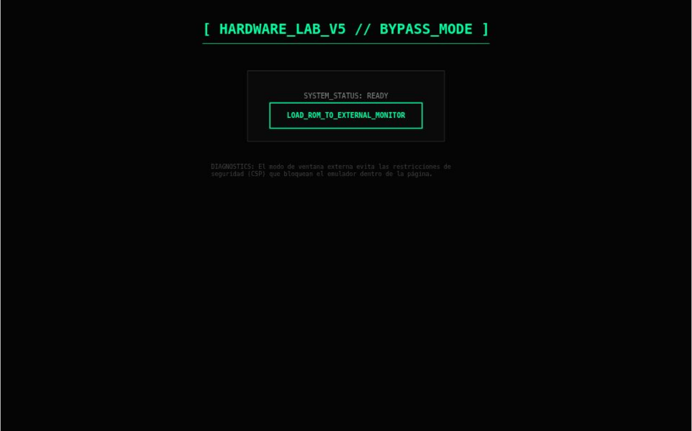

<h1 align="center">Dual Interface Interactive Portfolio 🎮💼</h1>

<p align="center">
  
</p>

[🇪🇸 Leer en Español](#español) | [🇬🇧 Read in English](#english)

---

<h2 id="english">🇬🇧 English</h2>

<p align="center">
  <strong>Front-End Engineering & Business Solutions</strong>
</p>

Welcome to my interactive portfolio repository. This application features two completely distinct interface modes within the same codebase, demonstrating advanced React state management, fluid animations, and custom styling.

### ✨ Features

* **Dual Experience UI**: 
  * 🕹️ **Retro Terminal**: A nostalgic, point-and-click interactive room environment built over an HTML canvas/CSS layout. Features CRT effects, pixel fonts, custom cursors, and animated interactive hotspots.
  * 🌐 **Modern Web**: A sleek, contemporary portfolio with smooth section transitions, bento-grid layouts, and a custom theme engine.
* **Custom Theme Engine**: In the Modern view, change between multiple aesthetic presets (Minimal, OLED, Tokyo, Emerald, Nordic, Rose) on the fly, with styles persisting via `localStorage`.
* **Multilingual System**: Built-in support for English and Spanish, switchable without reloading the page.
* **Fluid Animations**: Utilizing `motion/react` (+ Framer Motion primitives) for seamless mount/unmount page transitions, hover states, and revealing items on scroll.
* **Fully Responsive**: Both modes are optimized across devices. The Retro view scales its interactive hotspots proportionally, while the Modern view utilizes advanced grid behavior.

### 🛠 Tech Stack

* **Framework**: React 18 with Vite
* **Styling**: Tailwind CSS v4, custom CSS variables, pixelated rendering mode.
* **Animations**: `motion/react` (Framer Motion)
* **Icons**: `lucide-react`
* **Language Support**: Custom state-driven i18n structure.

### 🚀 Usage

```bash
# Install dependencies
npm install

# Run development server
npm run dev

# Build for production
npm run build
```

### 🗂️ Core Architecture

- `/src/components/modern/*`: Contains the sleek, responsive modern UI implementation and theme engine.
- `/src/components/game/*`: Specialized canvas-like pixel-art room with absolute positioned hotspots and CRT effects.
- `/src/components/ui/*`: Dialogs, interactive sections, and boot/loader components.

---

<h2 id="español">🇪🇸 Español</h2>

<p align="center">
  <strong>Ingeniería Front-End & Soluciones de Negocio</strong>
</p>

Bienvenido al repositorio de mi portafolio interactivo. Esta aplicación cuenta con dos modos de interfaz completamente distintos dentro del mismo código base, demostrando manejo avanzado de estados en React, animaciones fluidas y estilos personalizados.

### ✨ Características

* **Interfaz de Doble Experiencia**: 
  * 🕹️ **Terminal Retro**: Un entorno interactivo nostálgico tipo "point-and-click" construido sobre un diseño de canvas/CSS. Cuenta con efectos CRT, fuentes de píxeles, cursores personalizados y puntos de acceso (hotspots) interactivos animados.
  * 🌐 **Web Moderna**: Un portafolio elegante y contemporáneo con transiciones fluidas entre secciones, diseños bento-grid y un motor de temas personalizado.
* **Motor de Temas Personalizado**: En la vista Moderna, puedes cambiar entre múltiples configuraciones visuales (Mínimo, OLED, Tokyo, Esmeralda, Nórdico, Rosa) al instante, recordando tu opción mediante `localStorage`.
* **Sistema Multilingüe**: Soporte nativo y rápido para Inglés y Español sin necesidad de recargar la página.
* **Animaciones Fluidas**: Utilizando `motion/react` para transiciones fluidas de montaje/desmontaje de vistas, efectos hover y aparición de contenido por scroll.
* **Completamente Responsivo**: Ambos modos están optimizados para diferentes dispositivos. La vista Retro escala sus puntos interactivos de manera proporcional, mientras que la vista Moderna utiliza un comportamiento avanzado de grillas.

### 🛠 Tecnologías

* **Framework**: React 18 con Vite
* **Estilos**: Tailwind CSS v4, variables CSS personalizadas, modo de renderizado pixelado.
* **Animaciones**: `motion/react` (Framer Motion)
* **Iconos**: `lucide-react`
* **Idiomas**: Estructura i18n personalizada manejada a través de estados.

### 🚀 Uso

```bash
# Instalar dependencias
npm install

# Iniciar servidor de desarrollo
npm run dev

# Construir para producción
npm run build
```

### 🗂️ Arquitectura Central

- `/src/components/modern/*`: Contiene la implementación de la interfaz moderna y el motor de personalización visual.
- `/src/components/game/*`: Entorno especializado tipo habitación de pixel-art con puntos de interacción (hotspots) absolutos y efectos CRT.
- `/src/components/ui/*`: Diálogos, secciones interactivas y componentes de carga.

---

<p align="center">
  Hecho por Nicolás Bautista Pardo
</p>
<p align="center">
  <a href="https://linkedin.com/in/nicolaspardod">LinkedIn</a> • <a href="https://github.com/nicolaspardod">GitHub</a>
</p>
